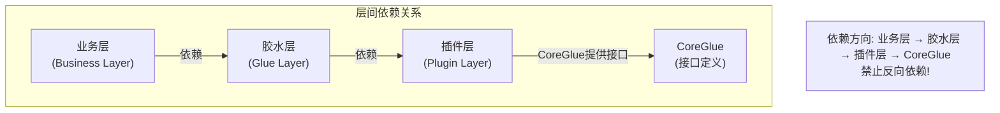
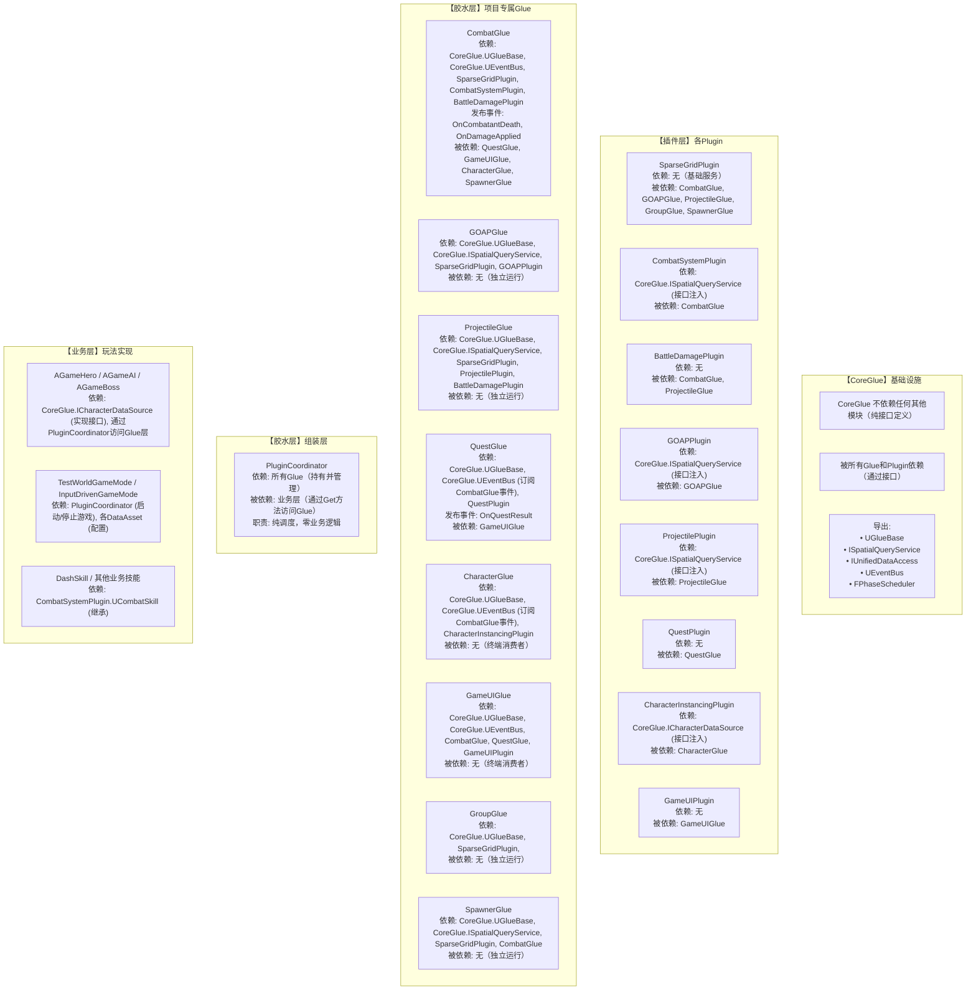
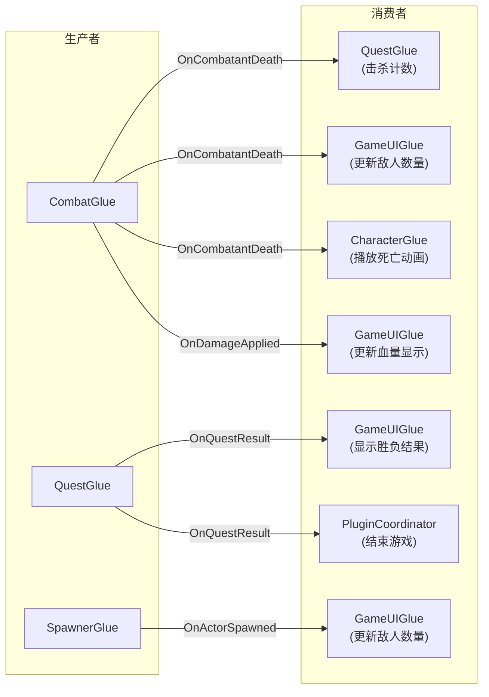

# TestWorld 游戏框架架构文档

> 版本: 1.0  
> 日期: 2026-05-11  
> 架构: 三层分离设计（插件层 / 胶水层 / 业务层）

---

## 1. 架构总览

```mermaid
flowchart TB
    subgraph L1["LAYER 1: 插件层 (Plugin Layer - 纯净核心)"]
        subgraph Plugins["功能插件"]
            P1["SparseGrid Plugin<br/>• 空间索引<br/>• 碰撞检测<br/>• 位置管理<br/>+ Config基类"]
            P2["Combat Plugin<br/>• 技能系统<br/>• 目标查询<br/>• 攻击调度<br/>+ Config基类"]
            P3["BattleDamage Plugin<br/>• 伤害计算<br/>• 治愈/击杀<br/>• 伤害数字"]
            P4["GOAP Plugin<br/>• AI规划<br/>• Action<br/>• WorldState<br/>+ Config基类"]
            P5["Projectile Plugin<br/>• 弹道系统<br/>• HISM渲染<br/>• 飞行碰撞"]
            P6["Quest Plugin<br/>• 任务目标<br/>• 胜负判定<br/>• 计时器"]
            P7["Character Instancing Plugin<br/>• 实例化渲染<br/>• 骨骼动画"]
            P8["GameUI Plugin<br/>• 数据绑定<br/>• UI管理<br/>• 流程控制"]
        end
        
        subgraph CoreGlue["CoreGlue (核心基础设施)"]
            CG1["GlueBase - Glue基类，生命周期管理"]
            CG2["ISpatialQuery - 空间查询接口定义"]
            CG3["UEventBus - 事件总线"]
            CG4["特点: 纯接口和基础设施，无业务逻辑，可被任何项目复用"]
        end
    end
    
    L1 -->|接口依赖 (只依赖CoreGlue的接口)| L2
    
    subgraph L2["LAYER 2: 胶水层 (Glue Layer - 数据桥接)"]
        subgraph ProjectGlue["Project Glue (项目专属)"]
            G1["CombatGlue - 为CombatSystem提供空间查询和伤害处理"]
            G2["GOAPGlue - 为GOAP提供WorldState和空间查询"]
            G3["ProjectileGlue - 为Projectile提供碰撞查询和伤害处理"]
            G4["QuestGlue - 为Quest提供死亡事件和计时器"]
            G5["CharacterGlue - 为CharacterInstancing提供动画状态"]
            G6["GameUIGlue - 为GameUI提供数据聚合"]
            G7["GroupGlue - 为SparseGridGroup提供空间查询"]
            G8["SpawnerGlue - 为Spawner提供位置选择和数量控制"]
            G9["特点: 包含项目特定的绑定逻辑，使用CoreGlue的基础设施"]
        end
        
        subgraph Coordinator["Coordinator (组装层)"]
            C1["UPluginCoordinator - 纯调度，零业务逻辑"]
            C2["• 创建所有Glue实例"]
            C3["• 按依赖顺序初始化"]
            C4["• 调度Tick循环"]
            C5["• 管理GameplaySuspension"]
            C6["特点: 属于胶水层，是胶水层的入口"]
        end
    end
    
    L2 -->|业务调用 (只通过Glue访问底层)| L3
    
    subgraph L3["LAYER 3: 业务层 (Business Layer - 玩法实现)"]
        B1["GameMode<br/>• 流程控制<br/>• 关卡管理<br/>• 初始化"]
        B2["Actor<br/>• AGameHero<br/>• AGameAI<br/>• AGameBoss"]
        B3["Skill Config<br/>• DashSkill<br/>• Weapon"]
        B4["Data Config<br/>• Combat<br/>• Spatial"]
        
        L3Note["特点:<br/>• 完全不直接访问Plugin，只通过Glue层或Coordinator暴露的接口<br/>• DataConfig: 使用DataAsset配置Plugin参数，避免硬编码"]
    end
```

---

## 2. 目录结构

```
TestWorld/
│
├── Plugins/                                    # 【插件层】
│   │
│   ├── CoreGlue/                               # 核心基础设施
│   │   └── Source/
│   │       └── CoreGlue/
│   │           ├── CoreGlue.Build.cs
│   │           ├── Public/
│   │           │   ├── GlueBase.h              # Glue基类
│   │           │   ├── SpatialQueryService.h   # 空间查询接口
│   │           │   ├── EventBus.h              # 事件总线
│   │           └── Private/
│   │               └── ...实现文件
│   │
│   ├── SparseGridPlugin/                       # 空间索引插件
│   │   └── Source/
│   │       └── SparseGridPlugin/
│   │           ├── Public/
│   │           │   ├── SparseGridManager.h
│   │           │   └── SparseGridComponent.h
│   │           └── Private/
│   │               └── ...实现文件
│   │
│   ├── CombatSystemPlugin/                     # 战斗系统插件
│   │   └── Source/
│   │       └── CombatSystemPlugin/
│   │           ├── Public/
│   │           │   ├── CombatManager.h
│   │           │   ├── CombatComponent.h
│   │           │   ├── CombatSkill.h
│   │           │   └── CombatWeapon.h
│   │           └── Private/
│   │               └── ...实现文件
│   │
│   ├── BattleDamagePlugin/                     # 伤害处理插件
│   │   └── Source/
│   │       └── BattleDamagePlugin/
│   │           ├── Public/
│   │           │   ├── BattleDamageManager.h
│   │           │   └── BattleDamageComponent.h
│   │           └── Private/
│   │               └── ...实现文件
│   │
│   ├── GOAPPlugin/                             # AI规划插件
│   │   └── Source/
│   │       └── GOAPPlugin/
│   │           ├── Public/
│   │           │   ├── GOAPManager.h
│   │           │   ├── GOAPPlanner.h
│   │           │   └── GOAPAgentComponent.h
│   │           └── Private/
│   │               └── ...实现文件
│   │
│   ├── ProjectilePlugin/                       # 弹道系统插件
│   │   └── Source/
│   │       └── ProjectilePlugin/
│   │           ├── Public/
│   │           │   └── ProjectileManager.h
│   │           └── Private/
│   │               └── ...实现文件
│   │
│   ├── QuestPlugin/                            # 任务系统插件
│   │   └── Source/
│   │       └── QuestPlugin/
│   │           ├── Public/
│   │           │   ├── QuestManager.h
│   │           │   ├── QuestInstance.h
│   │           │   └── QuestObjective.h
│   │           └── Private/
│   │               └── ...实现文件
│   │
│   ├── CharacterInstancingPlugin/              # 角色渲染插件
│   │   └── Source/
│   │       └── CharacterInstancingPlugin/
│   │           ├── Public/
│   │           │   ├── CharacterAnimManager.h
│   │           │   ├── CharacterSkelMeshComponent.h
│   │           │   └── ICharacterDataSource.h
│   │           └── Private/
│   │               └── ...实现文件
│   │
│   ├── GameUIPlugin/                           # UI系统插件
│   │   └── Source/
│   │       └── GameUIPlugin/
│   │           ├── Public/
│   │           │   ├── GameDataSubsystem.h
│   │           │   ├── GameUISubsystem.h
│   │           │   └── GameWidgetBase.h
│   │           └── Private/
│   │               └── ...实现文件
│   │
│
└── Source/                                     # 【项目代码】
    └── TestWorld/
        ├── TestWorld.Build.cs
        │
        ├── Public/
        │   │
        │   ├── Glue/                             # 【胶水层 - 项目专属Glue】
        │   │   ├── CombatGlue.h
        │   │   ├── GOAPGlue.h
        │   │   ├── ProjectileGlue.h
        │   │   ├── QuestGlue.h
        │   │   ├── CharacterGlue.h
        │   │   ├── GameUIGlue.h
        │   │   ├── GroupGlue.h
        │   │   └── SpawnerGlue.h
        │   │
        │   ├── Coordinator/                      # 【胶水层 - 组装层】
        │   │   └── PluginCoordinator.h
        │   │
        │   ├── Actors/                           # 【业务层 - Actor】
        │   │   ├── GamePawn.h
        │   │   ├── GameCharacter.h
        │   │   ├── GameHero.h
        │   │   ├── GameAI.h
        │   │   └── GameBoss.h
        │   │
        │   ├── GameMode/                         # 【业务层 - GameMode】
        │   │   ├── TestWorldGameMode.h
        │   │   └── InputDrivenGameMode.h
        │   │
        │   ├── Skills/                           # 【业务层 - 技能】
        │   │   └── DashSkill.h
        │   │
        │   ├── Data/                             # 【业务层 - 数据配置】
        │   │   ├── SpawnerConfig.h
        │   │   └── CharacterAnimData.h
        │   │
        │   └── Interfaces/                       # 【业务层 - 接口】
        │       └── GameObjectInfoInterface.h
        │
        └── Private/
            ├── Glue/
            │   ├── CombatGlue.cpp
            │   ├── GOAPGlue.cpp
            │   ├── ProjectileGlue.cpp
            │   ├── QuestGlue.cpp
            │   ├── CharacterGlue.cpp
            │   ├── GameUIGlue.cpp
            │   ├── GroupGlue.cpp
            │   └── SpawnerGlue.cpp
            │
            ├── Coordinator/
            │   └── PluginCoordinator.cpp
            │
            ├── Actors/
            │   ├── GamePawn.cpp
            │   ├── GameCharacter.cpp
            │   ├── GameHero.cpp
            │   ├── GameAI.cpp
            │   └── GameBoss.cpp
            │
            ├── GameMode/
            │   ├── TestWorldGameMode.cpp
            │   └── InputDrivenGameMode.cpp
            │
            └── ...其他业务实现
```

---

## 3. 依赖关系图

### 3.1 层间依赖



### 3.2 模块详细依赖



### 3.3 事件流向



**规则:**
- 所有事件通过 CoreGlue.UEventBus 中转
- Glue 只发布自己Plugin产生的事件
- Glue 只订阅自己Plugin需要的事件
- 禁止Glue之间直接调用（除了查询接口）

---

## 4. 核心类职责

### 4.1 CoreGlue 核心类

| 类名 | 职责 | 被谁使用 |
|------|------|----------|
| `UGlueBase` | Glue基类，提供Initialize/Shutdown/Tick/Suspend生命周期 | 所有项目Glue继承 |
| `ISpatialQueryService` | 空间查询接口，定义QueryActorsInSphere等方法 | Combat/GOAP/Projectile/Spawner Glue实现并注入 |
| `UEventBus` | 事件总线，Glue间通信的中介 | 所有Glue发布/订阅事件 |

### 4.2 项目Glue核心类

| Glue类 | 服务对象 | 核心职责 | 依赖的Plugin |
|--------|----------|----------|--------------|
| `UCombatGlue` | CombatSystemPlugin | 提供空间查询、伤害处理、事件转发 | SparseGrid, CombatSystem, BattleDamage |
| `UGOAPGlue` | GOAPPlugin | 提供WorldState同步、空间查询 | SparseGrid, GOAP |
| `UProjectileGlue` | ProjectilePlugin | 提供碰撞查询、伤害处理 | SparseGrid, Projectile, BattleDamage |
| `UQuestGlue` | QuestPlugin | 提供死亡事件监听、计时器 | Quest (+EventBus订阅Combat事件) |
| `UCharacterGlue` | CharacterInstancingPlugin | 提供动画状态同步 | CharacterInstancing (+EventBus订阅Combat事件) |
| `UGameUIGlue` | GameUIPlugin | 聚合战斗/任务数据推送到UI | GameUI (+查询CombatGlue/QuestGlue) |
| `UGroupGlue` |  提供空间查询 | SparseGrid |
| `USpawnerGlue` | SpawnerManager | 提供位置选择、数量控制 | SparseGrid, Spawner (+查询CombatGlue) |

### 4.3 组装层

| 类名 | 职责 | 依赖 |
|------|------|------|
| `UPluginCoordinator` | 创建Glue、绑定依赖、调度Tick、管理挂起 | 所有Glue（持有实例） |

---

## 5. 跨Plugin通信机制

本框架提供两套互补的跨Plugin通信机制，参考业界标准（Unreal Mass Subsystem、Unity DOTS ComponentLookup、EnTT Registry）设计。

### 5.1 机制概览

```
┌─────────────────────────────────────────────────────────────────────────────┐
│                       跨Plugin通信机制                                       │
├─────────────────────────────────────────────────────────────────────────────┤
│                                                                              │
│  ┌─────────────────────────────────────────────────────────────────────┐   │
│  │                    机制1: 接口注入 (即时查询)                        │   │
│  │                                                                      │   │
│  │  适用场景:                                                           │   │
│  │    • 需要立即返回结果的查询                                          │   │
│  │    • Plugin执行过程中的数据依赖                                      │   │
│  │    • 可在ParallelFor中安全调用                                       │   │
│  │                                                                      │   │
│  │  示例:                                                               │   │
│  │    • Combat查询周围敌人 → 目标选择                                  │   │
│  │    • GOAP查询可达位置 → 路径规划                                    │   │
│  │    • Projectile查询碰撞目标 → 伤害判定                              │   │
│  │    • Group查询邻近队友 → Boids计算                                  │   │
│  │                                                                      │   │
│  │  参考: Unreal Mass Subsystem模式、Unity ComponentLookup             │   │
│  │                                                                      │   │
│  └─────────────────────────────────────────────────────────────────────┘   │
│                                                                              │
│  ┌─────────────────────────────────────────────────────────────────────┐   │
│  │                    机制2: EventBus (异步通知)                        │   │
│  │                                                                      │   │
│  │  适用场景:                                                           │   │
│  │    • 不需要返回值的事件通知                                          │   │
│  │    • 可接受0~1帧延迟                                                │   │
│  │    • 多生产者，多消费者                                              │   │
│  │                                                                      │   │
│  │  示例:                                                               │   │
│  │    • 死亡通知 → Quest计数                                            │   │
│  │    • 伤害通知 → UI血量更新                                           │   │
│  │    • 任务完成 → UI结果显示                                           │   │
│  │                                                                      │   │
│  │  参考: EnTT Observer、Flecs Observer、Bevy Events                   │   │
│  │                                                                      │   │
│  └─────────────────────────────────────────────────────────────────────┘   │
│                                                                              │
│  ┌─────────────────────────────────────────────────────────────────────┐   │
│  │                    选择决策树                                        │   │
│  │                                                                      │   │
│  │  需要跨Plugin通信?                                                   │   │
│  │       │                                                              │   │
│  │       ├─ 需要返回值?                                                │   │
│  │       │    │                                                         │   │
│  │       │    ├─ YES → 接口注入 (即时查询)                              │   │
│  │       │    │                                                         │   │
│  │       │    └─ NO  → EventBus (异步通知)                              │   │
│  │       │                                                              │   │
│  │       └─ 不需要 → 直接调用 (同一Plugin内部)                         │   │
│  │                                                                      │   │
│  └─────────────────────────────────────────────────────────────────────┘   │
│                                                                              │
└─────────────────────────────────────────────────────────────────────────────┘
```

### 5.2 接口注入模式（即时查询）

#### 5.2.1 设计原理

```
┌─────────────────────────────────────────────────────────────────────────────┐
│                    接口注入模式原理                                          │
├─────────────────────────────────────────────────────────────────────────────┤
│                                                                              │
│  核心思想:                                                                   │
│    • Plugin 声明需要的接口（如 ISpatialQueryService）                        │
│    • Glue 在初始化时注入具体实现                                             │
│    • Plugin 在执行时直接调用接口，零延迟                                      │
│    • 线程安全由实现保证（分区锁/只读快照）                                    │
│                                                                              │
│  数据流向:                                                                   │
│                                                                              │
│  PluginCore                     Glue                        其他Plugin       │
│  ─────────                      ────                        ──────────       │
│                                                                              │
│  UCombatManager                 UCombatGlue                 USparseGrid      │
│       │                              │                           │           │
│       │ 需要空间查询能力             │                           │           │
│       │                              │                           │           │
│       │ SetSpatialQuery(Interface)   │                           │           │
│       │ ◄────────────────────────────┤                           │           │
│       │                              │                           │           │
│       │                              │  GridManager实现了接口     │           │
│       │                              ├──────────────────────────►│           │
│       │                              │                           │           │
│       │ QuerySphere() ──────────────►│                           │           │
│       │                              │ ─────────────────────────►│           │
│       │                              │                           │           │
│       │ ◄─── 返回结果 ───────────────┤ ◄─────────────────────────│           │
│       │                              │                           │           │
│                                                                              │
│  关键: Plugin 不知道 SparseGridPlugin 的存在，只知道接口                     │
│                                                                              │
└─────────────────────────────────────────────────────────────────────────────┘
```

#### 5.2.2 接口定义（CoreGlue）

```cpp
// CoreGlue/Public/SpatialQueryService.h

#pragma once

#include "CoreMinimal.h"
#include "UObject/Interface.h"
#include "SpatialQueryService.generated.h"

/**
 * 空间查询过滤器
 */
USTRUCT(BlueprintType)
struct FSpatialQueryFilter
{
    GENERATED_BODY()

    // 过滤的Actor类型
    UPROPERTY()
    TArray<TSubclassOf<AActor>> ActorClasses;

    // 派系过滤 (-1 = 不过滤)
    UPROPERTY()
    int32 FactionFilter = -1;

    // 最大距离
    UPROPERTY()
    float MaxDistance = MAX_FLT;
};

/**
 * 空间查询服务接口
 * 
 * 线程安全: 可在ParallelFor中安全调用
 * 实现: SparseGridPlugin.USparseGridManager
 */
UINTERFACE(MinimalAPI)
class USpatialQueryService : public UInterface
{
    GENERATED_BODY()
};

class ISpatialQueryService
{
    GENERATED_BODY()

public:
    /**
     * 球形范围查询
     * @param Center 查询中心
     * @param Radius 查询半径
     * @param Filter 过滤条件
     * @return 查询到的Actor列表
     */
    virtual TArray<AActor*> QueryActorsInSphere(
        const FVector& Center,
        float Radius,
        const FSpatialQueryFilter& Filter = FSpatialQueryFilter()) const = 0;

    /**
     * 盒形范围查询
     */
    virtual TArray<AActor*> QueryActorsInBox(
        const FVector& Center,
        const FVector& Extent,
        const FSpatialQueryFilter& Filter = FSpatialQueryFilter()) const = 0;

    /**
     * 查询最近的Actor
     */
    virtual AActor* QueryNearestActor(
        const FVector& Origin,
        const FSpatialQueryFilter& Filter = FSpatialQueryFilter()) const = 0;

    /**
     * 声明线程安全级别
     */
    virtual EThreadSafety GetThreadSafety() const { return EThreadSafety::ParallelSafe; }
};
```

#### 5.2.3 Plugin 使用接口

```cpp
// CombatSystemPlugin/Public/CombatManager.h

class UCombatManager : public UTickableWorldSubsystem
{
public:
    // 注入接口（由Glue调用）
    void SetSpatialQueryService(ISpatialQueryService* InService)
    {
        SpatialQuery = InService;
    }

    void ProcessCombat(float DeltaTime)
    {
        if (!SpatialQuery) return;

        // 可在ParallelFor中安全调用
        ParallelFor(RegisteredComponents.Num(), [&](int32 Index)
        {
            UCombatComponent* Comp = RegisteredComponents[Index];
            
            // 直接查询，零延迟
            FSpatialQueryFilter Filter;
            Filter.FactionFilter = Comp->GetEnemyFaction();
            
            TArray<AActor*> Targets = SpatialQuery->QueryActorsInSphere(
                Comp->GetPosition(),
                Comp->GetSkillRange(),
                Filter);

            // 执行战斗逻辑
            Comp->ProcessTargets(Targets);
        });
    }

private:
    ISpatialQueryService* SpatialQuery = nullptr;
};
```

#### 5.2.4 Glue 注入实现

```cpp
// TestWorld/Private/Glue/CombatGlue.cpp

void UCombatGlue::Bind(
    UCombatManager* InCombatManager,
    USparseGridManager* InGridManager,
    UBattleDamageManager* InDamageManager)
{
    CombatManager = InCombatManager;
    GridManager = InGridManager;
    DamageManager = InDamageManager;

    // 关键: 将 SparseGridManager 作为接口注入到 CombatManager
    // SparseGridManager 实现了 ISpatialQueryService 接口
    CombatManager->SetSpatialQueryService(GridManager);
}
```

#### 5.2.5 线程安全保证

```
┌─────────────────────────────────────────────────────────────────────────────┐
│                    线程安全方案                                              │
├─────────────────────────────────────────────────────────────────────────────┤
│                                                                              │
│  方案1: 分区锁 (SparseGridPlugin 已实现)                                     │
│  ─────────────────────────────────────────────────────────────────────────   │
│    • 31个分区（质数，均匀分布）                                              │
│    • 查询时只锁定涉及的分区                                                  │
│    • 不同分区的查询可并行                                                    │
│    • 适合: 高频查询，低竞争场景                                              │
│                                                                              │
│  方案2: 只读快照 (利用现有 Snapshot 机制)                                    │
│  ─────────────────────────────────────────────────────────────────────────   │
│    • Phase 0: Snapshot 创建 (GameThread)                                    │
│    • Phase 4+: 查询的是 Snapshot 数据 (只读)                                 │
│    • Snapshot 在整帧内不变 → 天然线程安全                                    │
│    • 适合: 可接受1帧延迟的查询                                               │
│                                                                              │
│  推荐:                                                                       │
│    • 默认使用分区锁 (已实现，零改动)                                         │
│    • 对性能敏感的查询使用快照模式                                            │
│                                                                              │
└─────────────────────────────────────────────────────────────────────────────┘
```

### 5.3 EventBus模式（异步通知）

#### 5.3.1 设计原理

```
┌─────────────────────────────────────────────────────────────────────────────┐
│                    EventBus模式原理                                          │
├─────────────────────────────────────────────────────────────────────────────┤
│                                                                              │
│  核心思想:                                                                   │
│    • 生产者发布事件到EventBus (GameThread)                                   │
│    • 消费者订阅事件，在下一帧处理                                            │
│    • 生产者和消费者完全解耦                                                  │
│                                                                              │
│  数据流向:                                                                   │
│                                                                              │
│  CombatGlue ──Publish──► EventBus ──Dispatch──► QuestGlue                   │
│       │                                            │                         │
│       │                                            │ 下一帧Tick中处理         │
│       │                                            ▼                         │
│       │                                    QuestManager更新                  │
│       │                                                                        │
│       ▼                                                                        │
│  立即返回 (不等待消费者)                                                       │
│                                                                              │
│  关键: 生产者和消费者完全解耦，通过 EventBus 间接通信                         │
│                                                                              │
└─────────────────────────────────────────────────────────────────────────────┘
```

#### 5.3.2 Glue 使用 EventBus

```cpp
// CombatGlue 发布事件 (可在任意线程)
void UCombatGlue::HandleCombatantDeath(AActor* DeadActor, AActor* Killer)
{
    if (EventBus)
    {
        EventBus->PublishCombatantDeath(DeadActor, Killer, 0.f);
    }
}

// QuestGlue 订阅事件
void UQuestGlue::Bind(UQuestManager* InQuestManager, UEventBus* InEventBus)
{
    QuestManager = InQuestManager;
    EventBus = InEventBus;

    // 订阅死亡事件
    EventBus->OnCombatantDeath.AddUObject(this, &UQuestGlue::HandleCombatantDeath);
}

void UQuestGlue::HandleCombatantDeath(AActor* DeadActor, AActor* Killer)
{
    QuestManager->NotifyActorDeath(DeadActor);
}

// GameUIGlue 订阅事件
void UGameUIGlue::Bind(...)
{
    // 订阅伤害事件 (UI更新必须在GameThread)
    EventBus->OnDamageApplied.AddUObject(this, &UGameUIGlue::HandleDamageApplied);
}

void UGameUIGlue::HandleDamageApplied(AActor* Target, float Damage, float RemainingHealth)
{
    // 在GameThread执行UI更新
    if (Target && Target->IsA<AGameHero>())
    {
        GameDataSubsystem->SetPlayerHealth(RemainingHealth, 100.f);
    }
}
```

### 5.4 两种机制对比

| 维度 | 接口注入 (即时查询) | EventBus (异步通知) |
|------|---------------------|---------------------|
| **延迟** | 0帧 (即时) | 0~1帧 |
| **返回值** | 有 | 无 |
| **线程模型** | 调用者线程执行 | 根据订阅者级别分配 |
| **耦合度** | 低 (通过接口) | 极低 (通过EventBus) |
| **适用场景** | 查询、数据获取 | 事件通知、状态同步 |
| **多线程支持** | 分区锁/快照保证 | 天然支持 |
| **参考** | Unreal Mass, Unity DOTS | EnTT, Flecs, Bevy |

### 5.5 行业参考

| 引擎/框架 | 即时查询方案 | 异步通知方案 |
|-----------|--------------|--------------|
| **Unreal Mass** | Subsystem + EntityQuery | Observer Processor |
| **Unity DOTS** | ComponentLookup | 无内置 (用Singleton) |
| **EnTT** | registry.get<T>() | Sink (on_construct/update/destroy) |
| **Flecs** | Singleton + Query | Observer |
| **Bevy** | Res<T> + Query | EventReader/EventWriter |

---

## 6. 关键设计原则

### 6.1 分层原则

```
┌─────────────────────────────────────────────────────────────────────────────┐
│                           分层设计原则                                       │
├─────────────────────────────────────────────────────────────────────────────┤
│                                                                              │
│  1. 插件层 (Plugin Layer)                                                    │
│     ─────────────────────                                                    │
│     • 每个Plugin是独立可复用的模块                                            │
│     • Plugin之间不直接依赖（除了CoreGlue的接口）                              │
│     • Plugin通过接口声明"我需要什么"，由外部注入                               │
│     • Plugin不感知Glue层的存在                                               │
│                                                                              │
│  2. 胶水层 (Glue Layer)                                                      │
│     ─────────────────────                                                    │
│     • 每个Glue只服务于一个Plugin                                              │
│     • Glue的职责是"让我的Plugin正常工作"                                      │
│     • Glue从其他Plugin获取数据，转换后提供给服务的Plugin                       │
│     • Glue通过EventBus发布事件，不直接调用其他Glue                            │
│     • Coordinator是胶水层的一部分，纯调度无业务逻辑                           │
│                                                                              │
│  3. 业务层 (Business Layer)                                                  │
│     ─────────────────────                                                    │
│     • 业务代码不直接访问Plugin                                                │
│     • 业务代码通过Glue层暴露的接口访问底层能力                                 │
│     • 业务代码通过Coordinator获取Glue实例                                     │
│     • 业务层包含：Actor、GameMode、技能配置、数据资产                          │
│     • 数据资产：创建Plugin Config的DataAsset实例，驱动Plugin行为              │
│                                                                              │
└─────────────────────────────────────────────────────────────────────────────┘
```

### 6.2 数据与逻辑分离原则

```
┌─────────────────────────────────────────────────────────────────────────────┐
│                       数据与逻辑分离原则                                       │
├─────────────────────────────────────────────────────────────────────────────┤
│                                                                              │
│  核心原则: 所有可配置数值必须通过DataAsset配置，禁止代码中硬编码              │
│                                                                              │
│  三层分工:                                                                   │
│  ─────────────────────────────────────────────────────────────────────────   │
│                                                                              │
│  插件层 (定义配置结构)                                                       │
│    • 每个Plugin定义自己的Config基类 (UXXXConfig : UDataAsset)                │
│    • 声明所有可配置参数 (EditDefaultsOnly)                                   │
│    • 提供SetConfig()接口供外部注入                                           │
│                                                                              │
│  业务层 (创建配置实例)                                                       │
│    • 在Content/Config/下创建具体DataAsset                                     │
│    • 支持多版本配置 (Default/HardMode/BossFight)                             │
│    • 策划可在编辑器中独立调整数值                                            │
│                                                                              │
│  胶水层 (注入配置)                                                           │
│    • Glue在Bind()时加载对应的DataAsset                                        │
│    • 调用Plugin的SetConfig()注入配置                                         │
│    • 支持运行时切换配置 (如难度变更)                                         │
│                                                                              │
│  禁止事项:                                                                   │
│    ❌ 代码中出现魔法数值 (const float MAX_RANGE = 500.0f;)                   │
│    ❌ 条件判断中硬编码阈值 (if (Count > 50))                                 │
│    ❌ 逻辑代码直接修改配置值                                                 │
│                                                                              │
└─────────────────────────────────────────────────────────────────────────────┘
```

### 6.3 配置归属规则

```
┌─────────────────────────────────────────────────────────────────────────────┐
│                       配置归属规则                                           │
├─────────────────────────────────────────────────────────────────────────────┤
│                                                                              │
│  配置分为三种存储方式，按"使用者"和"变更频率"划分:                          │
│                                                                              │
│  ┌─────────────────────────────────────────────────────────────────────┐   │
│  │  DataAsset — "游戏内容参数"                                         │   │
│  │                                                                      │   │
│  │  使用者: 策划 / TA / 关卡设计师                                     │   │
│  │  特征: 编辑器中可视化编辑，打包后不可修改，可版本控制               │   │
│  │                                                                      │   │
│  │  适用:                                                                │   │
│  │    ✅ 技能数值 (伤害、范围、冷却)                                    │   │
│  │    ✅ 角色属性 (血量、速度、AI参数)                                  │   │
│  │    ✅ 系统参数 (生成间隔、最大数量、波次规则)                        │   │
│  │    ✅ 关卡参数 (时间限制、胜利条件)                                  │   │
│  │    ✅ 动画/特效/物理参数                                              │   │
│  │                                                                      │   │
│  │  判断标准: "策划需要在编辑器中调整的数值"                            │   │
│  └─────────────────────────────────────────────────────────────────────┘   │
│                                                                              │
│  ┌─────────────────────────────────────────────────────────────────────┐   │
│  │  Blueprint — "实例行为配置"                                         │   │
│  │                                                                      │   │
│  │  使用者: 关卡设计师                                                 │   │
│  │  特征: 放在关卡中，每个实例可以不同，所见即所得                      │   │
│  │                                                                      │   │
│  │  适用:                                                                │   │
│  │    ✅ Actor摆放位置、旋转、缩放                                      │   │
│  │    ✅ 关卡中特定触发器的参数 (区域大小、延迟)                        │   │
│  │    ✅ 某个NPC的初始行为 (巡逻路径、初始状态)                          │   │
│  │    ✅ 组件的开关状态                                                  │   │
│  │                                                                      │   │
│  │  判断标准: "这个配置只对这个实例有效"                                │   │
│  │                                                                      │   │
│  │  ⚠️ BP中不应出现大量数值配置。                                      │   │
│  │    多个实例共享的数值 → 抽到DataAsset，BP只持有引用。               │   │
│  └─────────────────────────────────────────────────────────────────────┘   │
│                                                                              │
│  ┌─────────────────────────────────────────────────────────────────────┐   │
│  │  INI — "部署与运行时参数"                                           │   │
│  │                                                                      │   │
│  │  使用者: 程序员 / 运营                                               │   │
│  │  特征: 纯文本，打包后可修改，按平台区分，记事本即可编辑              │   │
│  │                                                                      │   │
│  │  适用:                                                                │   │
│  │    ✅ 玩家设置 (画质、音量、语言)                                    │   │
│  │    ✅ 服务器/网络配置 (IP、端口、最大玩家数)                         │   │
│  │    ✅ 平台差异 (移动端/PC不同的默认值)                                │   │
│  │    ✅ 调试开关 (bShowDebugInfo, bEnableCheats)                       │   │
│  │    ✅ 运营参数 (活动开关、AB测试分组)                                │   │
│  │                                                                      │   │
│  │  判断标准: "打包后可能需要修改，或按平台不同"                        │   │
│  └─────────────────────────────────────────────────────────────────────┘   │
│                                                                              │
│  快速判断流程:                                                              │
│                                                                              │
│    打包后需要改？                                                          │
│      ├─ YES → INI                                                          │
│      └─ NO → 多个实例共享？                                               │
│               ├─ YES → DataAsset                                          │
│               └─ NO → 和关卡摆放强相关？                                  │
│                        ├─ YES → Blueprint                                 │
│                        └─ NO → DataAsset                                  │
│                                                                              │
└─────────────────────────────────────────────────────────────────────────────┘
```

### 6.4 依赖原则

```
┌─────────────────────────────────────────────────────────────────────────────┐
│                           依赖管理原则                                       │
├─────────────────────────────────────────────────────────────────────────────┤
│                                                                              │
│  ✅ 允许的依赖:                                                              │
│     • 业务层 → 胶水层（通过Coordinator）                                      │
│     • 胶水层 → 插件层（直接持有Plugin引用）                                    │
│     • 胶水层 → CoreGlue（接口和基础设施）                                     │
│     • Plugin → CoreGlue（接口定义）                                           │
│     • Glue之间 → EventBus（事件订阅/发布）                                    │
│     • Glue之间 → 查询接口（只读访问其他Glue状态）                              │
│                                                                              │
│  ❌ 禁止的依赖:                                                              │
│     • 插件层 → 胶水层（Plugin不感知Glue）                                     │
│     • 插件层 → 业务层（Plugin不感知业务）                                     │
│     • 胶水层 → 业务层（Glue不感知业务）                                       │
│     • Glue之间直接调用（除了查询接口）                                        │
│     • 循环依赖（A依赖B，B依赖A）                                              │
│                                                                              │
│  ⚠️ 特殊情况:                                                                │
│        │
│     • 业务Actor实现CoreGlue.ICharacterDataSource（接口实现）                  │
│                                                                              │
└─────────────────────────────────────────────────────────────────────────────┘
```

---

## 7. 扩展指南

### 7.1 新增Plugin

```
步骤:
1. 在 Plugins/ 下创建新Plugin
2. 在 .Build.cs 中添加 CoreGlue 依赖
3. 定义Config基类 (UXXXConfig : UDataAsset)，声明可配置参数
4. 声明需要的接口（如 ISpatialQueryService）
5. 提供接口注入方法（如 SetSpatialQueryService）
6. 提供SetConfig()方法注入DataAsset配置
7. 在项目中创建对应的 Glue 类
8. 在业务层创建DataAsset配置实例
9. 在 PluginCoordinator 中绑定
```

### 7.2 新增Glue

```
步骤:
1. 在 Source/TestWorld/Public/Glue/ 下创建 {Name}Glue.h
2. 继承 UGlueBase
3. 实现 Bind() 方法，注入需要的Plugin引用和DataAsset配置
4. 实现 Tick() 方法（如果需要）
5. 声明发布的事件（如果需要）
6. 在 PluginCoordinator 中创建和绑定
```

### 7.3 新增业务功能

```
步骤:
1. 在 Source/TestWorld/ 下创建业务代码
2. 通过 GetWorld()->GetSubsystem<UPluginCoordinator>() 获取Coordinator
3. 通过 Coordinator->Get{X}Glue() 获取需要的Glue
4. 调用Glue暴露的接口或订阅事件
5. 禁止直接访问Plugin层
```

---

## 8. 文件生成清单

根据本文档，需要创建/修改的文件:

### CoreGlue (新建Plugin)
```
Plugins/CoreGlue/
├── CoreGlue.uplugin
└── Source/
    └── CoreGlue/
        ├── CoreGlue.Build.cs
        ├── Public/
        │   ├── CoreGlue.h
        │   ├── GlueBase.h
        │   ├── SpatialQueryService.h
        │   ├── EventBus.h
        └── Private/
            ├── CoreGlue.cpp
            ├── GlueBase.cpp
            └── EventBus.cpp
```

### 项目Glue (新建)
```
Source/TestWorld/
├── Public/Glue/
│   ├── CombatGlue.h
│   ├── GOAPGlue.h
│   ├── ProjectileGlue.h
│   ├── QuestGlue.h
│   ├── CharacterGlue.h
│   ├── GameUIGlue.h
│   ├── GroupGlue.h
│   └── SpawnerGlue.h
└── Private/Glue/
    ├── CombatGlue.cpp
    ├── GOAPGlue.cpp
    ├── ProjectileGlue.cpp
    ├── QuestGlue.cpp
    ├── CharacterGlue.cpp
    ├── GameUIGlue.cpp
    ├── GroupGlue.cpp
    └── SpawnerGlue.cpp
```

### 组装层 (新建)
```
Source/TestWorld/
├── Public/Coordinator/
│   └── PluginCoordinator.h
└── Private/Coordinator/
    └── PluginCoordinator.cpp
```

### 业务层 (已有，可能需要调整)
```
Source/TestWorld/
├── Public/
│   ├── Actors/
│   ├── GameMode/
│   ├── Skills/
│   ├── Data/
│   │   ├── CombatConfig.h          # 战斗配置 (继承UCombatConfig)
│   │   ├── SpatialConfig.h         # 空间配置 (继承USpatialConfig)
│   │   └── QuestConfig.h           # 任务配置 (继承UQuestConfig)
│   └── Interfaces/
└── Private/
    └── ...对应实现
```

### 数据配置 (业务层DataAsset)
```
Content/Config/
├── DA_CombatConfig_Default.uasset
├── DA_CombatConfig_HardMode.uasset
├── DA_SpatialConfig_Default.uasset
└── DA_QuestConfig_Main.uasset
```

---

## 9. 总结

本架构通过三层分离实现了:

1. **插件层**: 纯净核心，独立可复用
2. **胶水层**: 数据桥接，项目专属但结构清晰
3. **业务层**: 玩法实现，完全不依赖底层细节

关键设计:
- CoreGlue 提供基础设施，可被任何项目复用
- 每个Glue只服务于一个Plugin，职责单一
- **接口注入**: 即时查询，零延迟，参考Unreal Mass Subsystem模式
- **EventBus**: 异步通知，多线程安全，参考EnTT/Flecs Observer模式
- **数据驱动**: Plugin定义Config基类，业务层创建DataAsset实例，Glue注入配置
- PluginCoordinator 纯调度，零业务逻辑
- 依赖方向严格单向: 业务 → 胶水 → 插件 → CoreGlue

跨Plugin通信决策:
- 需要返回值 → 接口注入 (即时查询)
- 不需要返回值 → EventBus (异步通知)
- 同一Plugin内部 → 直接调用

数据与逻辑分离:
- Plugin层: 定义Config基类（UCombatConfig, USpatialConfig等）
- 业务层: 创建DataAsset实例（DA_Combat_Default, DA_Combat_HardMode等）
- 胶水层: Glue加载并注入配置到Plugin
- 禁止: 代码中硬编码数值，所有可配置项必须来自DataAsset

配置归属:
- DataAsset: 策划需在编辑器中调整的游戏内容参数
- Blueprint: 关卡中特定实例的行为配置（位置、巡逻路径等）
- INI: 打包后需修改的部署与运行时参数
